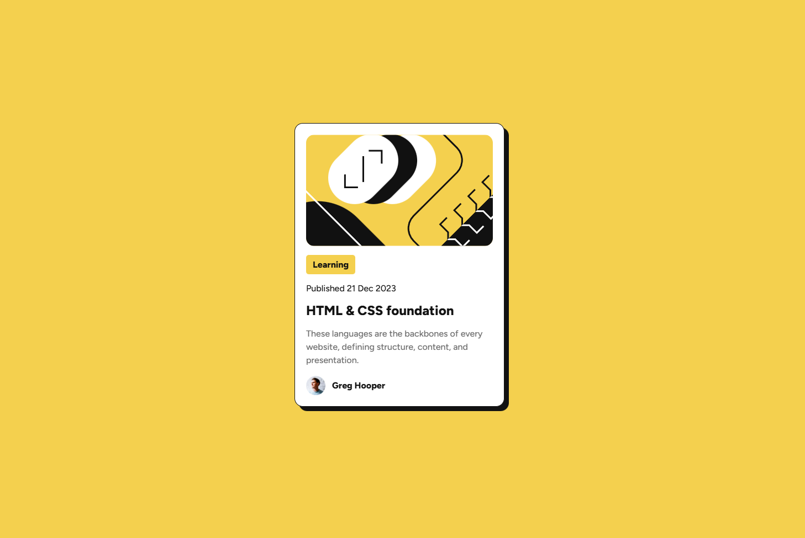

# 🌐 Frontend Mentor - Blog preview card solution

This is my solution for the [Blog preview card challenge on Frontend Mentor](https://www.frontendmentor.io/challenges/blog-preview-card-ckPaj01IcS). Frontend Mentor challenges help you improve your coding skills by building realistic projects. 

---

## 📋 Table of contents

- [Overview](#-overview)
  - [Features](#-features)
  - [Preview](#-preview)
  - [Links](#-links)
- [My process](#-my-process)
  - [Built with](#-built-with)
  - [What I learned](#-what-i-learned)
- [Development Workflow](#-development-workflow)
- [Useful Resources](#-useful-resources)
- [Author](#-author)
- [Acknowledgments](#-acknowledgments)

---

## 🌍 Overview

### ✨ Features

This page displays a Blog preview card closely matching the original design.
This preview card introduces the essentials of HTML and CSS, the foundational languages that shape how every website is built and displayed.
The component also includes a nice slide-in and shadow-pop animation that plays when the page loads.

### 🖼️ Preview



### 🔗 Links

- 💡 Solution URL: [Frontend Mentor Submission](https://www.frontendmentor.io/solutions/blog-preview-card-with-css-and-tailwindcss-LR2oXSDOXU)
- 🌐 Live Site URL: [Live Demo](https://thewizard04-blog-card.netlify.app/)

---

## 🛠️ My process

### 🧰 Built with

| Category  | Tools                           |
| --------- | ------------------------------- |
| Structure | **Semantic HTML5 markup**       |
| Styles    | **CSS** and **Tailwind CSS v4** |

### 🧠 What I learned

- Improved my understanding of semantic HTML5 markup
- Strengthened my styling skills using CSS and Tailwind CSS
- Explored creating animations to enhance the user experience

Here are the snippets for the animation:

```css
--animate-appear-card: appear-card 0.6s ease-in-out both;
```

```css
@keyframes appear-card {
  0% {
    opacity: 0;
    box-shadow: 0 0 var(--color-gray-950);
    transform: translateY(50px);
  }
  50% {
    opacity: 1;
    box-shadow: 0 0 var(--color-gray-950);
    transform: translateX(0) translateY(0);
  }
  100% {
    opacity: 1;
    box-shadow: 8px 8px var(--color-gray-950);
    transform: translateX(-8px) translateY(-8px);
  }
}
```

---

## 🧩 Development Workflow

### 🧱 Local Setup

1. **Start using Tailwind in your HTML**
   ```html
   <link rel="stylesheet" href="styles/tailwindcss/output.css" />
   ```
2. **Start using CSS in your HTML**
    ```html
   <link rel="stylesheet" href="styles/css/index.css" />
   ```

Then open your index.html file in the browser.

---

## 📖 Useful Resources

- [HTML Semantic Elements](https://www.w3schools.com/html/html5_semantic_elements.asp) - A helpful article explaining semantic HTML5 elements and their purpose.
- [CSS Animations](https://www.w3schools.com/css/css3_animations.asp) - A clear introduction to CSS animations and keyframes

---

## 👨‍💻 Author

- GitHub - [CrazyWizard04](https://github.com/CrazyWizard04)
- Frontend Mentor - [@CrazyWizard04](https://www.frontendmentor.io/profile/crazywizard04)

---

## 💖 Acknowledgments

A big thanks to **Frontend Mentor** for providing this project.
Their challenges are a great way for developers of all levels to practice, learn, and improve their skills through real-world examples.

Thank you <3
